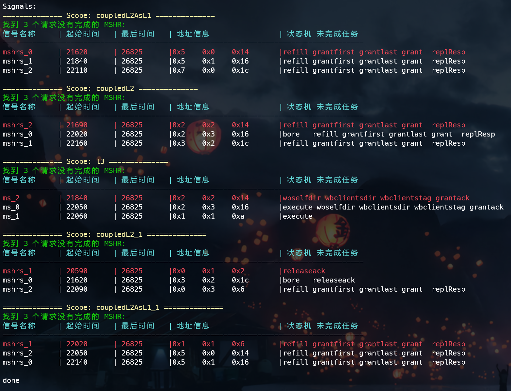
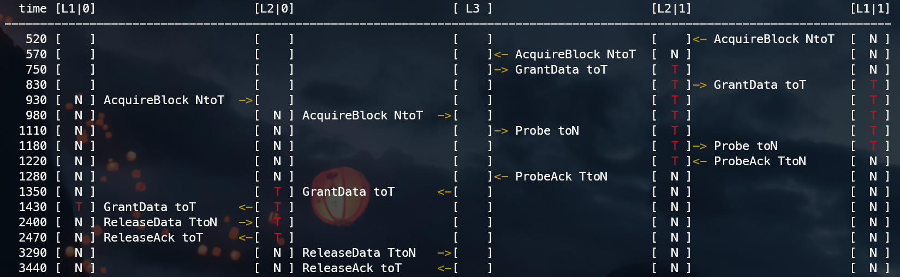
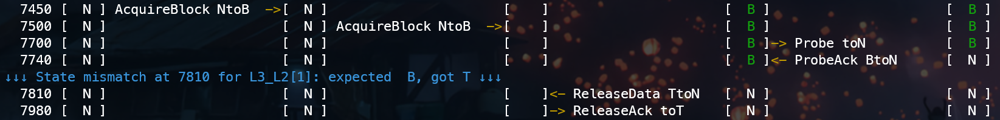

# [Pylibfst](https://github.com/mschlaegl/pylibfst): Handle *Fast Signal Traces* (fst) in Python

Pylibfst is a python cffi wrapper for a slightly extended version of the fst C library contained in gtkwave.
It was initially created to add support for fst to [WAL](https://wal-lang.org) (*Waveform Analysis Language*), developed at the [Institute for Complex Systems](https://ics.jku.at/) at Johannes Kepler University, Linz.

For details of Installation, Usage and Examples of pylibfst, check [pylibfst/README.md](https://github.com/mschlaegl/pylibfst/blob/master/README.md)

## Final State Parser (Used for Deadlock)

It will parse the final states of all pending MSHRs at deadlock, including their start time, end time, address, unfinished State Machines.

Usage:

`python3 cache/deadlock_parser.py <fst_path>`

**Notice**: manual modification of signal names and tag/set width is required for each different cache configuration.

TODO: add <u>replaced block info</u> when `release` related state unfinished.

## Transaction Log Parser and Visualizer

It will extract all the transactions of a specific address across all levels, and visualize them in a timeline.

Usage:

`python3 cache/tllog_parser.py <fst_path> <target_addr> | sort -k 1 -n > tl.log && python3 cache/tllog_visual.py tl.log`

For better performance, we will first extract all the transactions in L20, then L21, L10, L11, one by one. Next we use `sort` to order them by time. Finally we use `tllog_visual.py` to visualize the log.

**State Check** is also added to detect abnormal state changes. 

When Grant(`toB/toT`), client state is recorded. 
When Release/ProbeAck, client will also report its state(`TtoN/TtoB/BtoN`). 

If these two state differs (+if we do not implement silent evict), something must went wrong about the state transition. 
This will help us capture the error in the first place.

